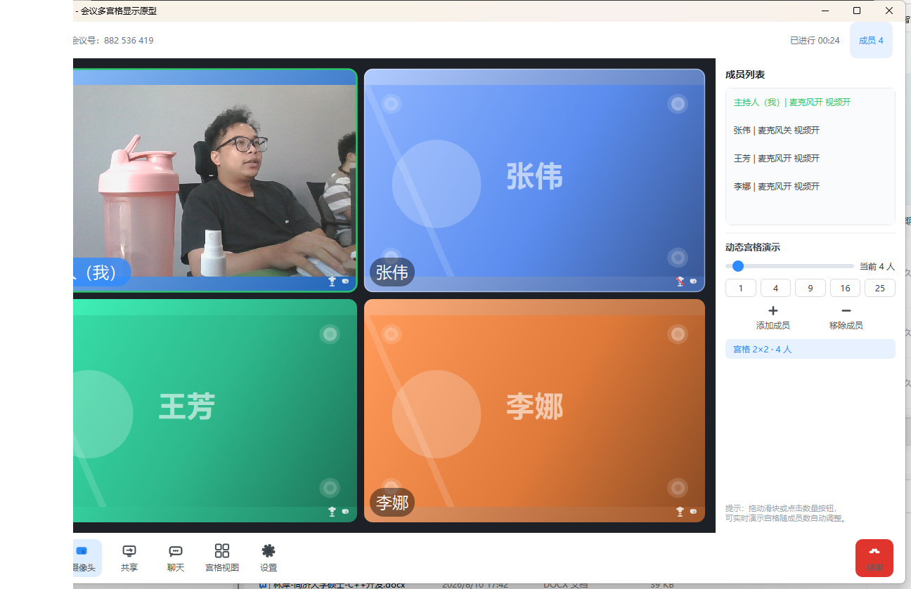

# MeetingGrid — 会议多宫格显示原型（C++ / Qt 6）

参照产品设计图实现的会议多宫格显示界面原型。核心能力：**根据参会成员数量动态调整宫格行列数**，宫格自动铺满可用区域。

 *默认 4 人，2×2 宫格*

## 特性

- **动态宫格**：1 人 → 1×1，2 人 → 1×2，3-4 人 → 2×2，5-6 人 → 3×2，7-9 人 → 3×3，… 通用公式 `列数 = ⌈√n⌉，行数 = ⌈n/列⌉`（`GridManager` 纯逻辑，附单元测试覆盖 0~100 人）
- **宫格内视频渲染**：主持人宫格接入真实摄像头（QCamera），远端成员使用模拟视频画面；支持**裁剪填充 / 等比缩放**两种填充模式
- **摄像头开关闭环**：底部"摄像头"按钮真实启动/停止视频源，关闭时宫格显示剪影 + "摄像头已关闭"；摄像头不可用时自动回退到模拟画面
- **麦克风开关闭环**：底部"麦克风"按钮真实启停音频采集（QAudioSource），实时 RMS 音量检测 + 滞回阈值判定说话状态，说话时主持人宫格绿色高亮、成员列表同步
- **宫格视图 / 演讲者视图**一键切换（演讲者视图下点击任意宫格可切换主画面）
- **设置面板**：摄像头/麦克风设备选择、视频填充模式、模拟画面帧率调节
- **右侧成员管理面板**：成员列表、滑块 / 快捷按钮（1/4/9/16/25）增减成员、实时显示当前宫格行列
- **单个宫格**：视频/头像 + 名字胶囊 + 麦克风/摄像头状态图标 + 说话/选中高亮 + 摄像头关闭剪影 + 空格占位（"等待成员加入"）
- **底部控制栏**：麦克风、摄像头、共享屏幕、聊天、视图切换、设置、结束会议（手绘矢量图标，无外部资源依赖）
- **聊天面板**：可折叠，支持发送消息
- **会议计时**：顶栏实时显示会议时长
- 启动参数 `--members=N` 可直接演示指定人数的宫格

 *阶段二：主持人宫格为真实摄像头画面，其余为模拟视频画面*

## 环境要求

| 组件 | 版本 |
|------|------|
| 操作系统 | Windows 10/11 x64 |
| 编译器 | MSVC 2022+（v143 工具集） |
| Qt | Qt 6.10.x（msvc2022_64） |
| 构建工具 | CMake ≥ 3.16 + Ninja |

## 构建

项目已内置 `build.bat`（假定环境与本文一致，可自行修改路径）：

```
cd MeetingGrid
build.bat            # Release 构建
build.bat Debug      # Debug 构建
```

手动构建（配置好 MSVC 环境后）：

```bash
cmake -S . -B build -G Ninja -DCMAKE_BUILD_TYPE=Release ^
      -DCMAKE_PREFIX_PATH=D:/Qt/6.10.3/msvc2022_64 ^
      -DCMAKE_MAKE_PROGRAM=D:/Qt/Tools/Ninja/ninja.exe
cmake --build build
```

## 运行

```bash
build\MeetingGrid.exe                  # 默认 4 人
build\MeetingGrid.exe --members=9      # 9 人，3×3 宫格
build\MeetingGrid.exe --members=16     # 16 人，4×4 宫格
```

> 若直接双击运行缺少 DLL，先执行 `deploy.bat` 将 Qt 运行库拷贝到 exe 目录。

## 工程结构

```
MeetingGrid/
├── CMakeLists.txt          # Qt6 Widgets + Multimedia 构建配置 + 单元测试目标
├── build.bat               # Windows 一键构建脚本
├── deploy.bat              # windeployqt 部署脚本
├── src/
│   ├── main.cpp            # 入口，支持 --members=N
│   ├── MainWindow.*        # 主窗口：顶栏 + 宫格区 + 成员面板 + 控制栏 + 聊天 + 设置
│   ├── GridContainer.*     # 宫格容器：Gallery/Speaker 两种布局的动态摆放
│   ├── GridManager.*       # 核心算法：成员数 -> 行列数
│   ├── VideoTile.*         # 单个宫格组件（视频/头像/名字/状态/占位）
│   ├── VideoSource.*       # 视频源：SimulatedVideoSource（模拟）+ CameraVideoSource（QCamera 采集）
│   ├── AudioSource.*       # 麦克风采集（QAudioSource）+ RMS 音量说话检测（滞回阈值）
│   ├── ControlButton.*     # 带图标与文字的自绘按钮
│   └── IconFactory.*       # QPainter 手绘图标库
├── tests/
│   └── tst_gridmanager.cpp # GridManager 单元测试（QtTest，0~100 人全量）
├── docs/
│   ├── 开发计划.md         # 分阶段开发计划（原型 -> 功能落地）
│   └── screenshots/        # 各规模宫格 / 阶段二视频渲染运行截图
└── README.md
```

## 单元测试

```
cmake --build build          # 生成 build/gridtest.exe
build\gridtest.exe           # 或 ctest --test-dir build -V
```

## 下一步

阶段二核心（摄像头采集 + 宫格内视频渲染 + 麦克风采集与说话检测 + 设置面板）已完成。收尾项（布局拖动排序、状态持久化、分辨率设置）与后续开发路线见 [docs/开发计划.md](docs/开发计划.md)：
网络会议（WebRTC）等。
